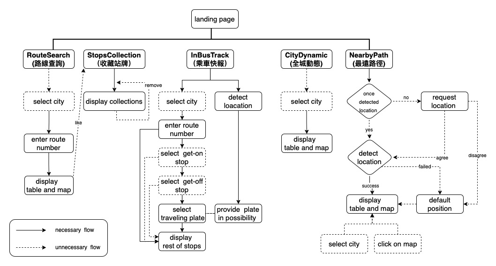
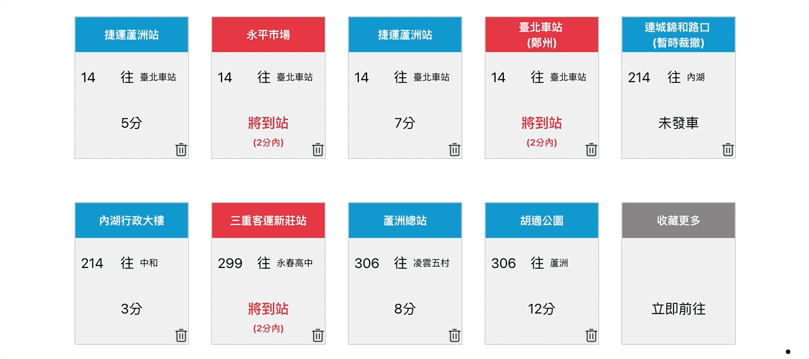

  

<h1 align="center">Bus Live</h1>

<!-- TABLE OF CONTENTS -->
<!-- 
 -->
  
Outline

  <ol>
    <li><a href="#description">Description</a></li>
    <li><a href="#link">Link</a></li>
    <li><a href="#feature-skills">Feature Skills</a></li>
    <li><a href="#function-map">Function Map</a></li>
    <li><a href="#feature-demo">Feature Demo</a>
      <ul style="margin-left: -20px;">
        <li><a href="#route-search">Route Search (路線查詢)</a></li>
        <li><a href="#stops-collection">Stops Collection (收藏站牌)</a></li>
        <li><a href="#in-bus-track">In-Bus-Track(乘車快報)</a></li>
        <li><a href="#city-dynamic">City Dynamic(全城動態)</a></li>
        <li><a href="#nearby-bus-path">Nearby Bus Path(最遠路徑)</a></li>
        <li><a href="#dark-mode">Dark Mode</a></li>
      </ul>
    </li>
  </ol>
<!-- 
 -->

<!-- Description -->

## Description

A website provided with realtime city bus information and some special features.

Basically, BusLive is used to check estimated waiting time and checked bus position. While user could do more, such as track bus current stop in the bus on your mobile device. Or, track all city buses' position or driving path on the map -- just for fun.

## Link

http://bus-live-d2581.web.app

## Feature Skills

#### Programing

  <ul>
    <li>React</li>
  </ul>

#### Packaging Tools

  <ul>
    <li>Git</li>
    <li>Eslint</li>
    <li>Prettier</li>
    <li>Styled Components</li>
    <li>React Router</li>
    <li>Leaflet</li>
    <li>Open Street Map</li>
  </ul>

## Function Map

## 

##

## Feature Demo

### Route Search(路線查詢)

It's a basic feature for user check time, position and path of city bus of specific route. Just like any bus App you've been ever download. Besides, this feature provide a visualization map for you to seize entire bus of route.

### Stops Collection（收藏站牌）

If user desired to frequently check same stop and route -- on work, off work, out of home -- Stops Collection give a shortcut to save it. When ever open this page, all stops is saying hello to you.

### In Bus Track(乘車快報)

Have you ever been confused about what stop you pass through in the bus? Most people is stocked on running text on display board, and probably want to identify it from scene out of window.

With In-Bus-Track, user merely need to key-in some bus info and get current driving bus destination, current stop and all stops betweens start and end. You don't need to be nervous of confusing about where am I now.

### City Dynamic(全城動態)

Usually, we observer a route at one time for immediate needs to get on bus. This website give a funny feature for entertainment.

City Dynamics show all operating bus on the map, marked as different color based on speed and status. User could check each bus' position and its route number.

### Nearby Bus Path(最遠路徑)

People who lives in Taipei City or New Taipei City mostly rely on Metro system.
While for some, metro may not be first choice(it can be far rather then bus stop).

This feature provide probability seizing all nearby bus stops and buses went through with its driving path.

Some users may benefited from feature:
1.worker which seeking new rental position
2.no metro around you or housing place
3.looking for fun
4.people who want to start unknowing destination traveling

### Dark Mode

One click to change website color from white to dark, providing more comfortable experience at night.

 
 

(<a href="#top">Back To Top</a>)

